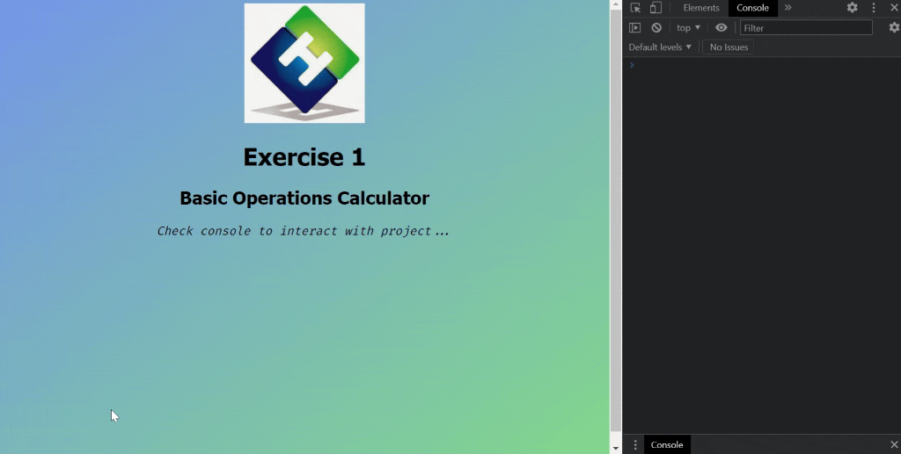

<div align=center>
	<h1>Basic Calculator</h1>
</div>

<div align="center">
	<a href="https://ehkarabas.github.io/js-exercises/interactiveJSexercises/basicCalculator/">
		
	</a>
	<br>
	
</div>

## Description

Basic calculator with four operations. 

## Goals

Practicing on loops and conditions.


## Resource Structure 

```
basicCalculator(folder)
|
|-- README.md
|-- images
|   |-- basicCalculator-presentation.gif
|   |-- ehlogo.jpg
|-- index.html
|-- script
|   |-- basicCalculator.js
|-- style
    |-- style.css
```


