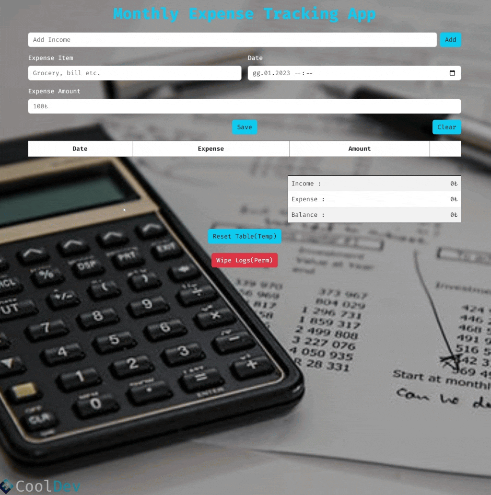

<div align=center>
	<h1>Budget App</h1>
</div>

<div align="center">
	<a href="https://ehkarabas.github.io/js-exercises/interactiveJSexercises/budgetApp/">
		
	</a>
	<br>
	
</div>

## Description

The app automatically resets on a monthly basis for tracking monthly budget. 
If desired, all data can be wiped without waiting for the monthly auto reset. 
It informs the user with a modal window for every action. 
The data is stored in local storage until the next month and is rendered from there on every refresh.

## Goals

Practicing on loops, conditions, collections, destructuring, local storage, DOM.


## Resource Structure 

```
budgetApp(folder)
|
|-- README.md
|-- images
|   |-- budgetApp-presentation.gif
|   |-- ehlogo-transparent.png
|-- index.html
|-- script
|   |-- app.js
|-- style
    |-- style.css
```


