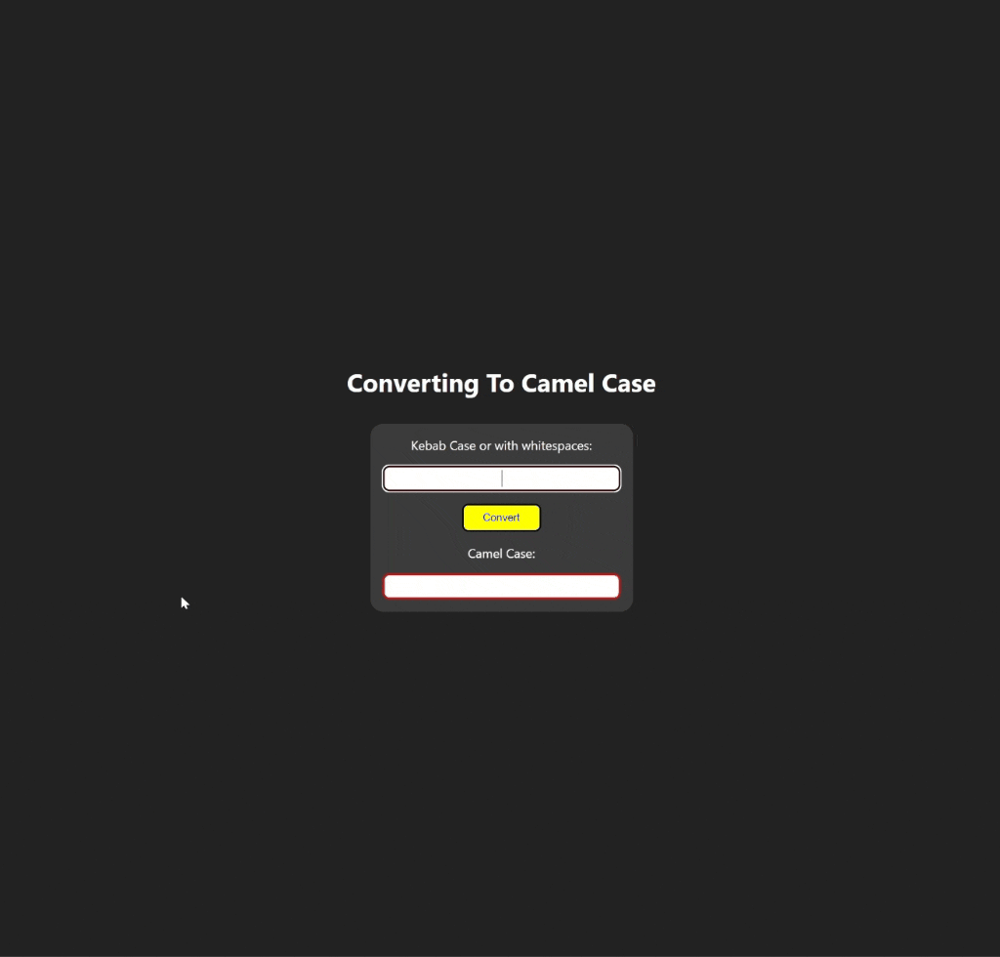

<div align=center>
	<h1>Camel Case Converter</h1>
</div>

<div align="center">
	<a href="https://ehkarabas.github.io/js-exercises/interactiveJSexercises/camelCaseConverter/">
		
	</a>
	<br>
	
</div>

## Description

Converting kebab case or with whitespaces to camel case.

## Goals

Practicing on arrays, strings, conditions, DOM.


## Resource Structure 

```
camelCaseConverter(folder)
|
|-- README.md
|-- images
|   |-- camelCaseConverter-presentation.gif
|-- index.html
|-- script
|   |-- camelCaseConverter.js
|-- style
    |-- style.css
```


