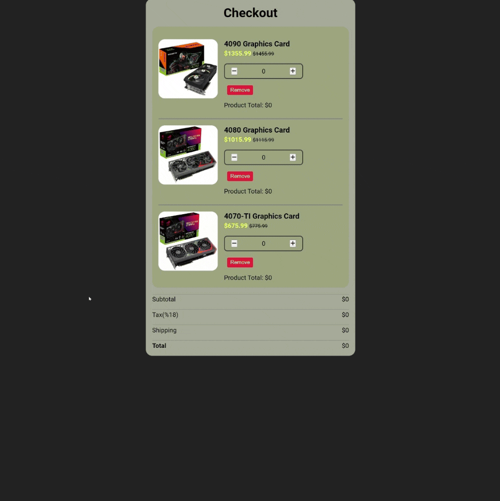

<div align=center>
	<h1>Checkout Page</h1>
</div>

<div align="center">
	<a href="https://ehkarabas.github.io/js-exercises/interactiveJSexercises/checkoutPage/">
		
	</a>
	<br>
	
</div>

## Description

Checkout page. Products can be removed on screen, all fee fields related with each other.

## Goals

Practicing on loops, conditions, collections, DOM.


## Resource Structure 

```
checkoutPage(folder)
|
|-- README.md
|-- assets
|   |-- 4070ti.jpg
|   |-- 4080.jpg
|   |-- 4090.jpg
|-- images
|   |-- checkoutPage-presentation.gif
|   |-- ref.gif
|-- index.html
|-- script
|   |-- app.js
|-- style
    |-- style.css
```


