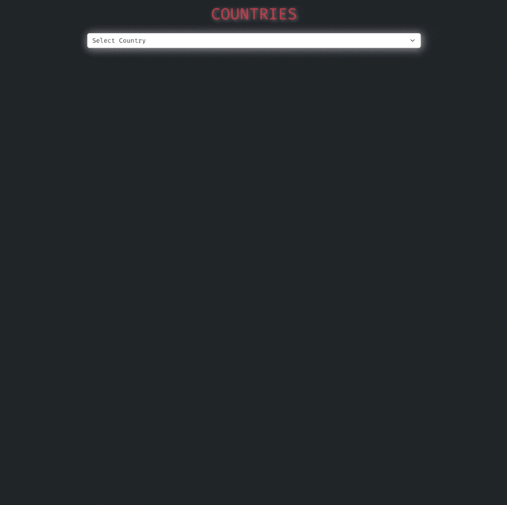

<div align=center>
	<h1>Country Infos App</h1>
</div>

<div align="center">
	<a href="https://ehkarabas.github.io/js-exercises/interactiveJSexercises/countryInfos/">
		
	</a>
	<br>
	
</div>

## Description

Country Infos app. Fetching country datas, creating a country list and then display information of a specific country on screen. 
If a data isnt present on the server, still continuing to display that country infos with the data present on the server.
The datas are displaying after modifying to the appropriate format.

## Goals

Practicing on conditions, collections, loops, array & string methods, data fetching from API's, DOM.


## Resource Structure 

```
countryInfos(folder)
|
|-- README.md
|-- images
|   |-- 404.png
|   |-- flagApp-presentation.gif
|-- index.html
|-- script
|   |-- app.js
|-- style
    |-- style.css
```


