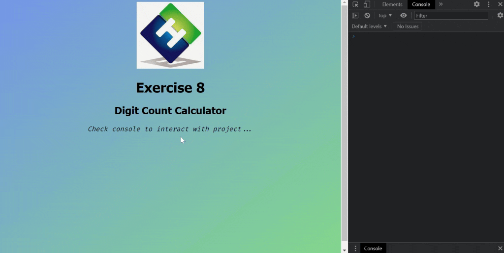

<div align=center>
	<h1>Digits Count Calculator</h1>
</div>

<div align="center">
	<a href="https://ehkarabas.github.io/js-exercises/interactiveJSexercises/digitCountCalculator/">
		
	</a>
	<br>
	
</div>

## Description

Calculating digits count of a number. 

## Goals

Practicing on loops and conditions.


## Resource Structure 

```
digitCountCalculator(folder)
|
|-- README.md
|-- images
|   |-- digitCountCalculator-presentation.gif
|   |-- ehlogo.jpg
|-- index.html
|-- script
|   |-- digitCountCalculator.js
|-- style
    |-- style.css
```


