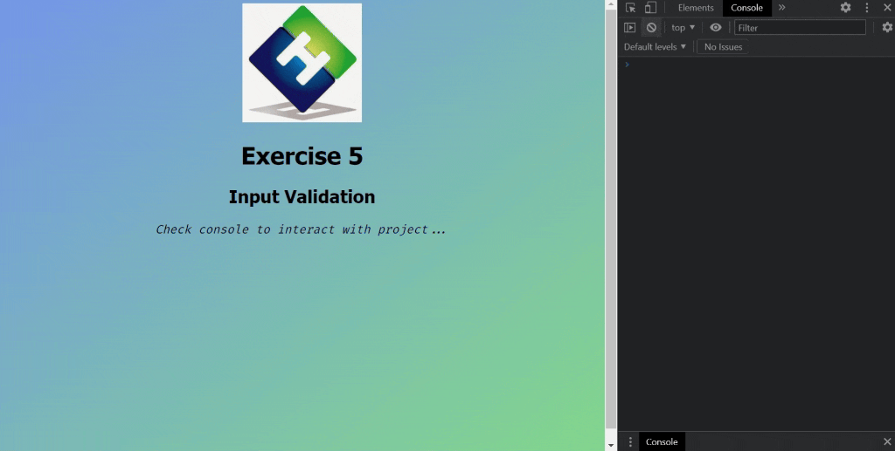

<div align=center>
	<h1>Input Validation</h1>
</div>

<div align="center">
	<a href="https://ehkarabas.github.io/js-exercises/interactiveJSexercises/inputValidation/">
		
	</a>
	<br>
	
</div>

## Description

Validating an input whether is a number between 0 and 100.

## Goals

Practicing on loops and conditions.


## Resource Structure 

```
inputValidation(folder)
|
|-- README.md
|-- images
|   |-- ehlogo.jpg
|   |-- inputValidation-presentation.gif
|-- index.html
|-- script
|   |-- inputValidation.js
|-- style
    |-- style.css
```


