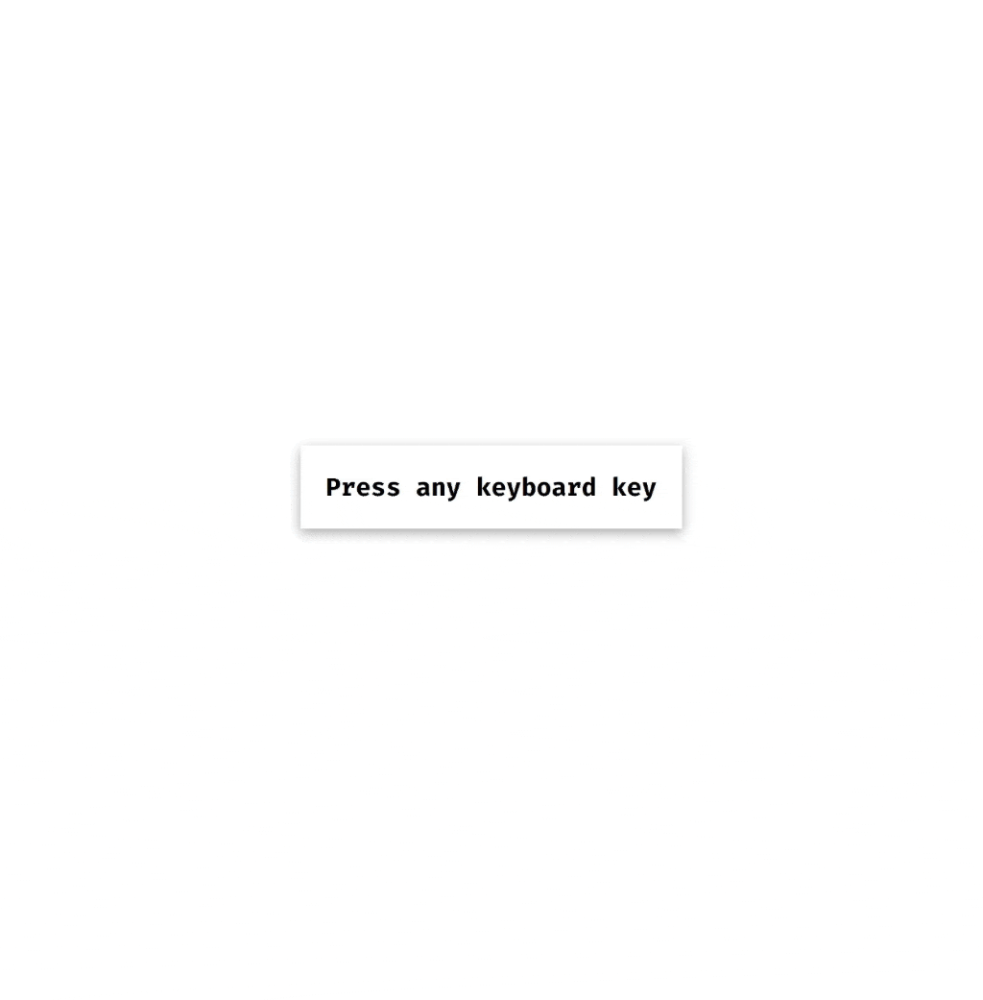

<div align=center>
	<h1>Keyboard Key Press Logger</h1>
</div>

<div align="center">
	<a href="https://ehkarabas.github.io/js-exercises/interactiveJSexercises/keyboardKeyPress/">
		
	</a>
	<br>
	
</div>

## Description

Printing pressed key and its ASCII code on the screen

## Goals

Practicing on DOM.


## Resource Structure 

```
keyboardKeyPress(folder)
|
|-- README.md
|-- app.js
|-- index.html
|-- keyboardKeypress-presentation.gif
```


