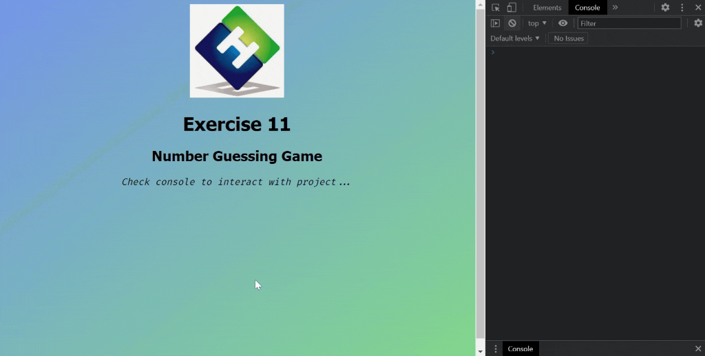

<div align=center>
	<h1>Number Guessing Game</h1>
</div>

<div align="center">
	<a href="https://ehkarabas.github.io/js-exercises/interactiveJSexercises/numberGuessingGame/">
		
	</a>
	<br>
	
</div>

## Description

Game of guessing a random number between 0 and 100 within 5 trials.

## Goals

Practicing on loops and conditions.


## Resource Structure 

```
numberGuessingGame(folder)
|
|-- README.md
|-- images
|   |-- ehlogo.jpg
|   |-- numberGuessingGame-presentation.gif
|   |-- reference.png
|-- index.html
|-- script
|   |-- numberGuessing.js
|-- style
    |-- style.css
```


