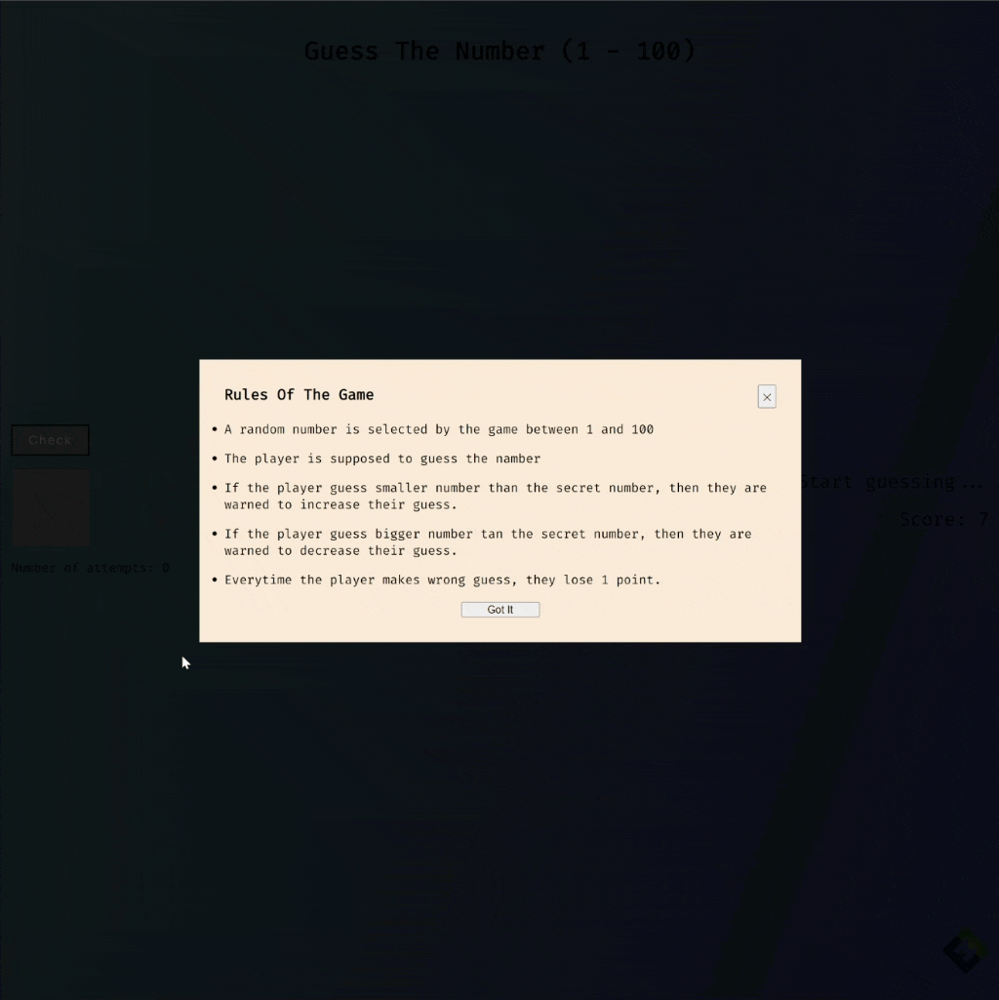

<div align=center>
	<h1>Number Guessing Game Advanced</h1>
</div>

<div align="center">
	<a href="https://ehkarabas.github.io/js-exercises/interactiveJSexercises/numberGuessingGameAdv/">
		
	</a>
	<br>
	
</div>

## Description

Game of guessing a random number between 1 and 100 within 7 trials. Fully responsive layout, used timed and non-timed local storage values.

## Goals

Practicing on conditions, DOM, local storage.


## Resource Structure 

```
numberGuessingGameAdv(folder)
|
|-- README.md
|-- images
|   |-- cute.gif
|   |-- ehlogo-transparent.png
|   |-- guess.png
|   |-- hat.png
|   |-- numberGuessingGameAdv-presentation.gif
|   |-- sad.png
|-- index.html
|-- script
|   |-- app.js
|-- style
    |-- style.css
```


