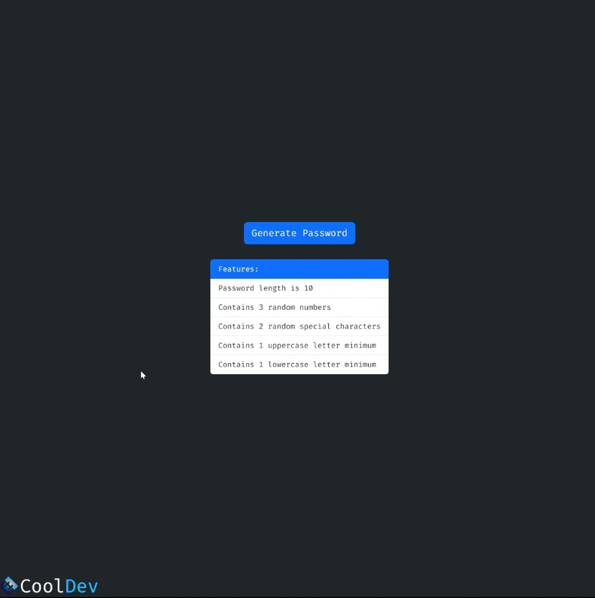

<div align=center>
	<h1>Password Generator</h1>
</div>

<div align="center">
	<a href="https://ehkarabas.github.io/js-exercises/interactiveJSexercises/passwordGenerator/">
		
	</a>
	<br>
	
</div>

## Description

Generating random password according to these rules:
- Password length should be 10.
- Password needs to contain 3 random numbers, 2 random special characters, at least 1 uppercase and lowercase letter.

## Goals

Practicing on conditions, loops, DOM.


## Resource Structure 

```
passwordGenerator(folder)
|
|-- README.md
|-- images
|   |-- ehlogo-transparent.png
|   |-- passwordGenerator-presentation.gif
|-- index.html
|-- script
|   |-- app.js
|-- style
    |-- style.css
```


