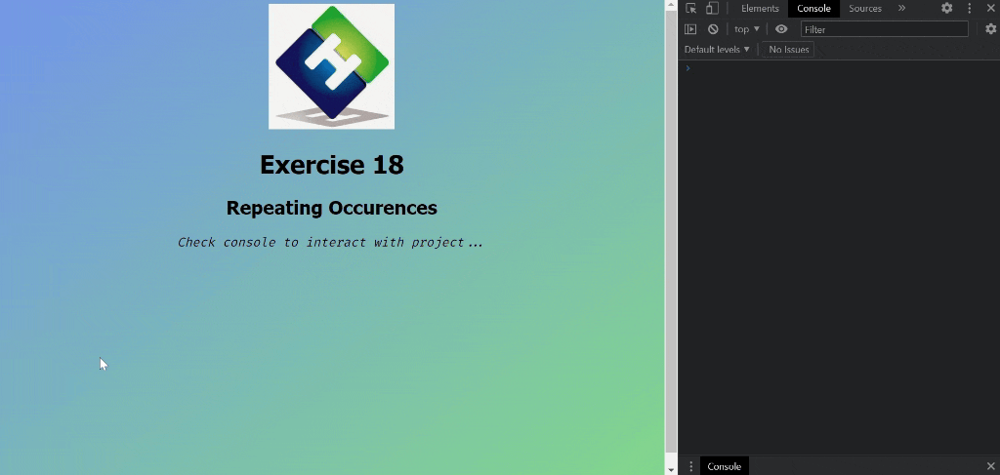

<div align=center>
	<h1>Repeating Occurences</h1>
</div>

<div align="center">
	<a href="https://ehkarabas.github.io/js-exercises/interactiveJSexercises/repeatingOccurences/">
		
	</a>
	<br>
	
</div>

## Description

Returning non-unique items of an array.

## Goals

Practicing on strings, arrays and regex patterns.


## Resource Structure 

```
repeatingOccurences(folder)
|
|-- README.md
|-- images
|   |-- ehlogo.jpg
|   |-- repeatingOccurences-presentation.gif
|-- index.html
|-- script
|   |-- repeatingOccurences.js
|-- style
    |-- style.css
```


