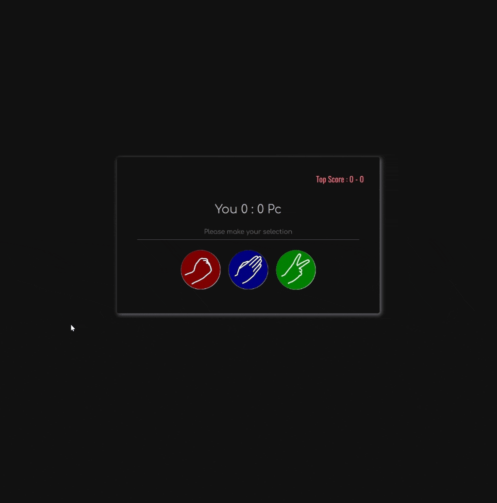

<div align=center>
	<h1>Rock Paper Scissors</h1>
</div>

<div align="center">
	<a href="https://ehkarabas.github.io/js-exercises/interactiveJSexercises/rockPaperScissors/">
		
	</a>
	<br>
	
</div>

## Description

Rock & Paper & Scissors game with features such as top-score stored in local storage, replay, and a modal window that appears at the end of the game.

## Goals

Practicing on conditions, DOM, local storage.


## Resource Structure 

```
rockPaperScissors(folder)
|
|-- README.md
|-- assets
|   |-- paper.png
|   |-- rock.png
|   |-- scissors.png
|-- images
|   |-- game.jpeg
|   |-- rockPaperScissors-presentation.gif
|-- index.html
|-- script
|   |-- app.js
|-- style
    |-- style.css
```


