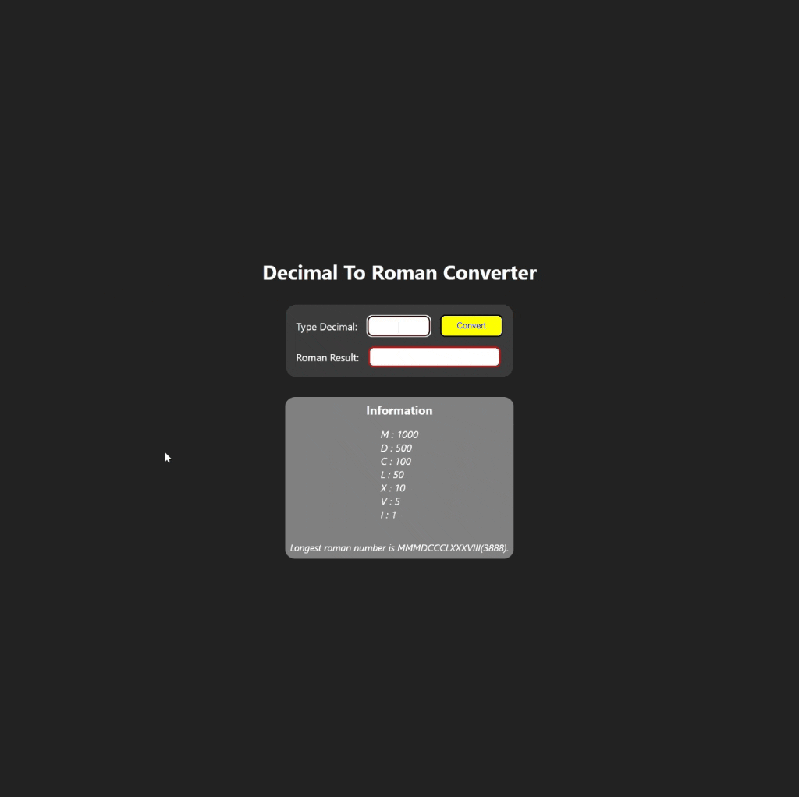

<div align=center>
	<h1>Decimal To Roman Converter</h1>
</div>

<div align="center">
	<a href="https://ehkarabas.github.io/js-exercises/interactiveJSexercises/romanNumerals/">
		
	</a>
	<br>
	
</div>

## Description

Converting decimal numbers to roman numbers.

## Goals

Practicing on conditions, DOM.


## Resource Structure 

```
romanNumerals(folder)
|
|-- README.md
|-- images
|   |-- romanNumerals-presentation.gif
|-- index.html
|-- script
|   |-- app.js
|-- style
    |-- style.css
```


