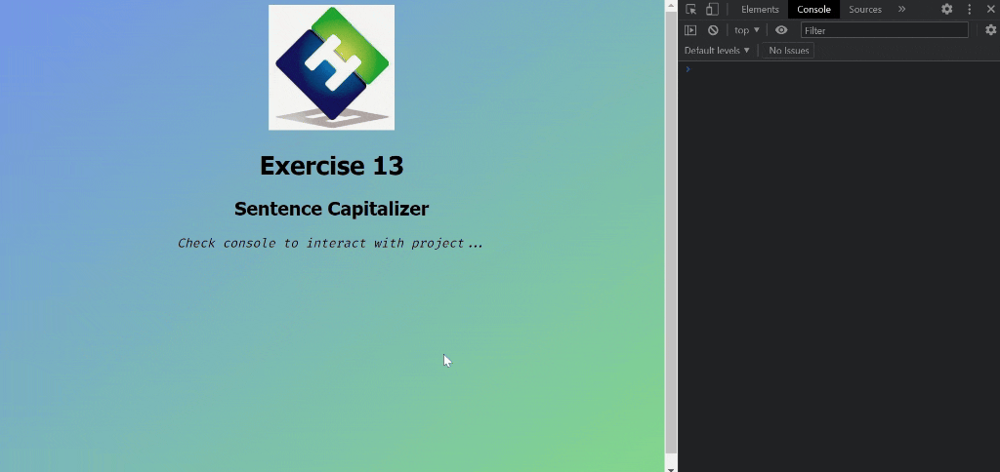

<div align=center>
	<h1>Sentence Capitalizer</h1>
</div>

<div align="center">
	<a href="https://ehkarabas.github.io/js-exercises/interactiveJSexercises/sentenceCapitalizer/">
		
	</a>
	<br>
	
</div>

## Description

Capitalizing a sentence validated by a regex pattern.

## Goals

Practicing on strings and regex patterns.


## Resource Structure 

```
sentenceCapitalizer(folder)
|
|-- README.md
|-- images
|   |-- ehlogo-transparent.png
|   |-- ehlogo.jpg
|   |-- sentenceCapitalizer-presentation.gif
|-- index.html
|-- script
|   |-- sentenceCapitalizer.js
|-- style
    |-- style.css
```


