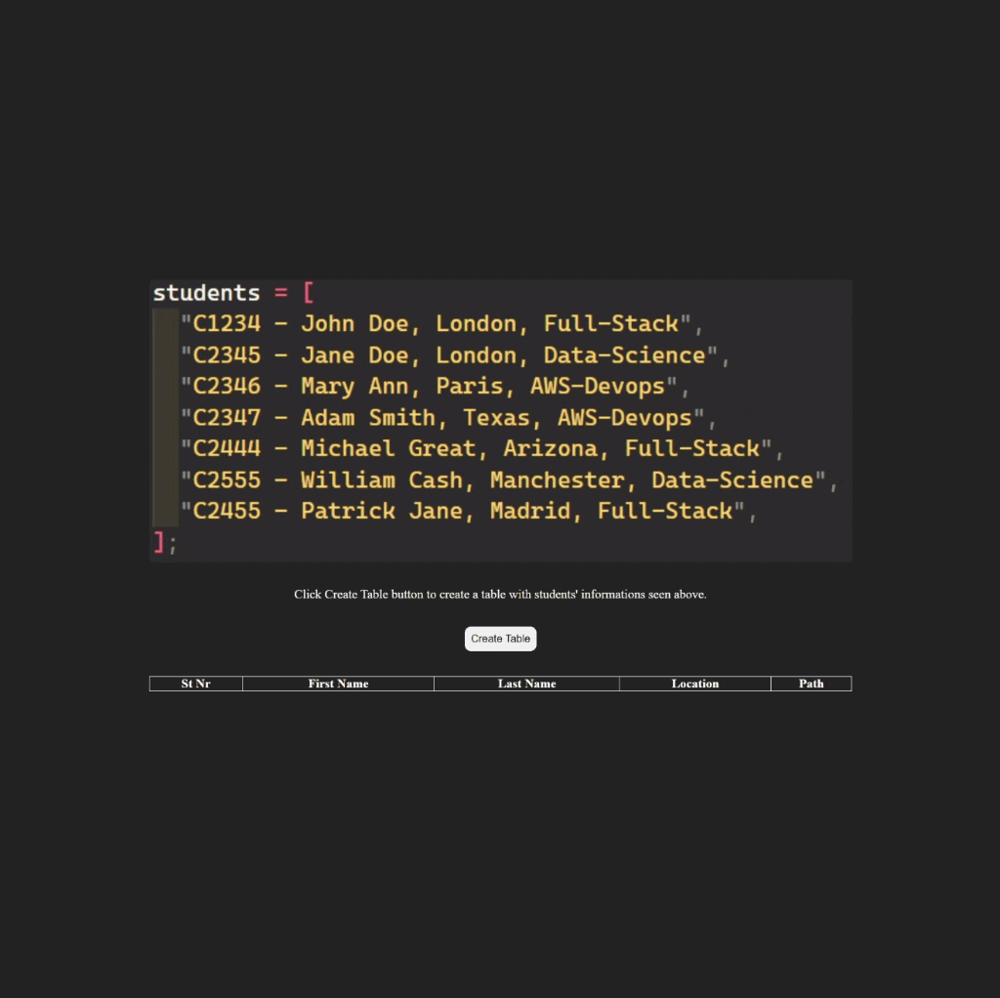

<div align=center>
	<h1>Table Builder</h1>
</div>

<div align="center">
	<a href="https://ehkarabas.github.io/js-exercises/interactiveJSexercises/tableBuilder/">
		
	</a>
	<br>
	
</div>

## Description

Rearranging a given data collection and creating table according to its content then refreshing the table after some time.

## Goals

Practicing on arrays, strings, timer methods, DOM.


## Resource Structure 

```
tableBuilder(folder)
|
|-- README.md
|-- images
|   |-- studentsInformations.png
|   |-- tableBuilder-presentation.gif
|-- index.html
|-- script
|   |-- app.js
|-- style
    |-- style.css
```


