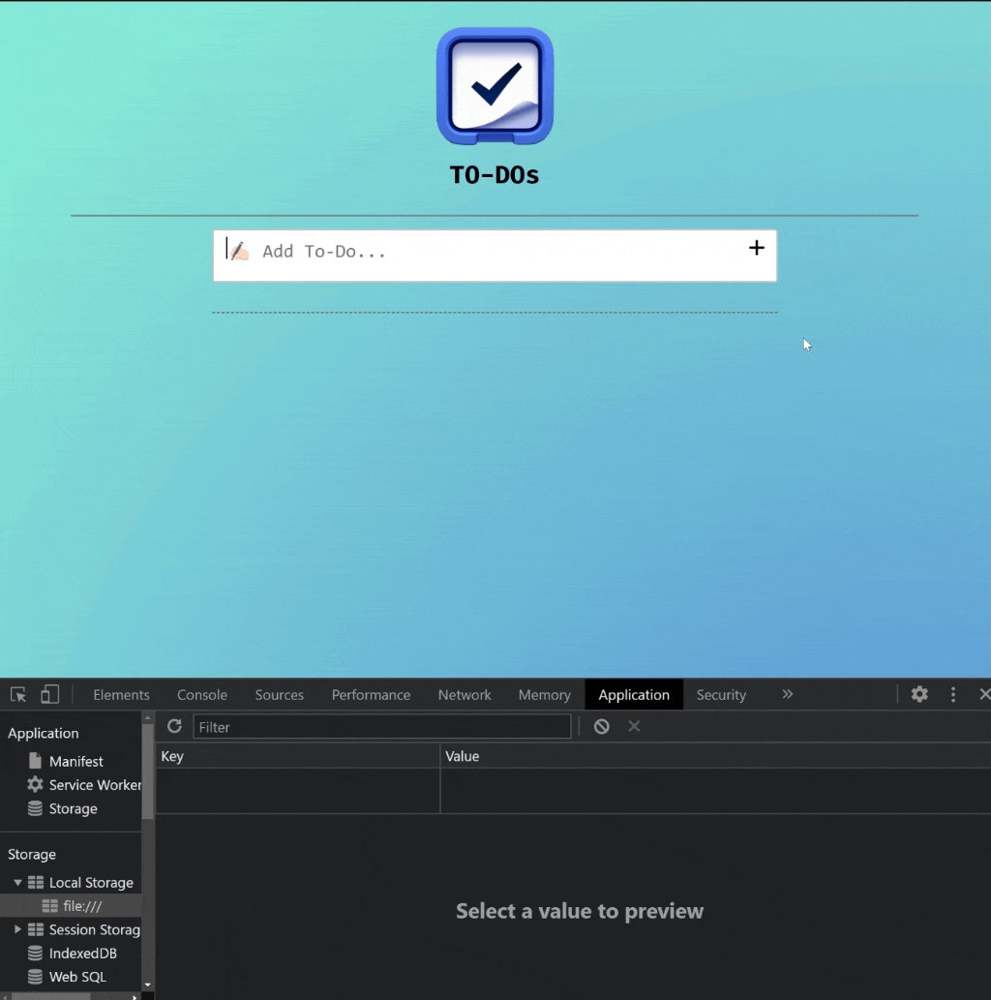

<div align=center>
	<h1>To-Do App</h1>
</div>

<div align="center">
	<a href="https://ehkarabas.github.io/js-exercises/interactiveJSexercises/toDoAdv/">
		
	</a>
	<br>
	
</div>

## Description

To-Do list project. Dynamically updating local storage keys by numeric & time order when removing or adding items to the list. 
Inputs with check mark are storing in local storage as well thus when coming back same layout can be seen.
Inputs are editable and comes with approval/denial icons. 
Every controller has different relationship with others, when you click some of them, some others become disabled.
Input areas are size friendly. Multi-rows supported, you can log long inputs.   

## Goals

Practicing on loops, conditions, collections, destructuring, local & session storages, DOM.


## Resource Structure 

```
toDoAdv(folder)
|
|-- README.md
|-- images
|   |-- ref
|   |   |-- project_002_1.gif
|   |   |-- project_002_2.gif
|   |   |-- project_002_3.gif
|   |   |-- project_002_4.gif
|   |-- toDoBanner.png
|   |-- toDoAdv-presentation.gif
|-- index.html
|-- script
|   |-- app.js
|-- style
    |-- style.css
```


